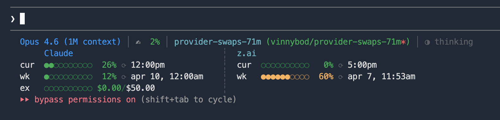
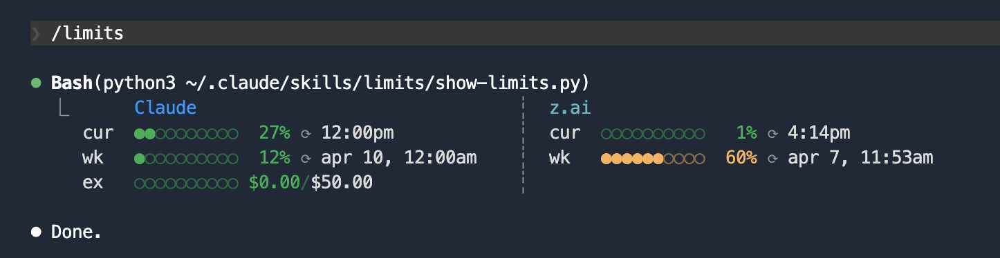

I have been seeing a bit of hype around GLM 5.1 and its impressive benchmarks. So I got the lowest paid tier membership ($10) for [z.ai](https://z.ai/), which provides an Anthropic-compatible API for GLM models. My thinking: it could serve as a backup when I hit usage limits and a place to offload tasks like code reviews.

## Setup

I decided to just ask Claude to read through the z.ai docs on how to connect Claude Code to the GLM models. While this got us to a point where I could use GLM, the setup was [not ideal](https://docs.z.ai/devpack/tool/claude) because writing to `settings.json` impacts all sessions, or a local `settings.json` impacts all the sessions in that directory. I wanted something on a per-session basis. It turns out you can basically do the same thing with just environment variables. To make it a bit more convenient, I wrote a simple wrapper for my "z.ai claude"

`~/.config/claude-providers/zai.env`:
```sh
export ANTHROPIC_AUTH_TOKEN={z.ai api token}
export ANTHROPIC_BASE_URL=https://api.z.ai/api/anthropic
export API_TIMEOUT_MS=3000000
export ANTHROPIC_DEFAULT_OPUS_MODEL=glm-5.1
export ANTHROPIC_DEFAULT_SONNET_MODEL=glm-4.7
export ANTHROPIC_DEFAULT_HAIKU_MODEL=glm-4.5-air
```

`cz` script on path
```sh
#!/bin/bash
source ~/.config/claude-providers/zai.env
exec claude "$@"
```

Now I can invoke my GLM version of Claude with `cz`. And since the env vars are scoped to the process, I can run `cz` and `claude` side by side in separate terminals.

## Tracking Usage

The last piece, I've been using my own variation of [kamranahmedse/claude-statusline](https://github.com/kamranahmedse/claude-statusline). So I asked Claude to look at the z.ai usage api and append its usage to the status line. After a little back and forth on text alignment and caching, we got it settled.



And since I've been having issues with multi-line status lines disappearing in the Claude Code interface intermittently, I threw it into a `/limits` command as well.



## Quirks

There are some quirks to using the non-Anthropic models with Claude such as `/voice` not being available and `WebSearch` not working. Swapping between providers mid-session also seems to just cause errors from the provider. I'm sure there's a ton more that I'll come across. I've really only used it for about an hour at this point. But, I can use my favorite skills without needing to switch tools and still get the familiarity of my preferred agent harness.

---

The next piece I will probably explore and write about is invoking `cz` as a tool from an "Anthropic" session.

If you are interested in the `cz` and `limits` scripts, you can find them in [vinnybod/blog-examples](https://github.com/vinnybod/blog-examples/tree/main/claude-musings/per-session-swapping).
