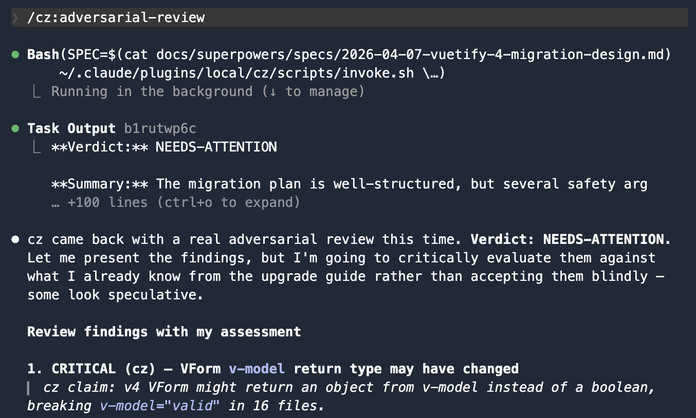
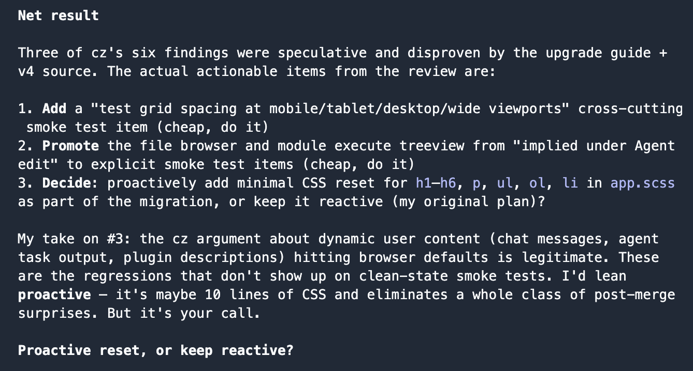

In the [last post](/posts/claude-musings-per-session-provider-swapping), I set up `cz` - a wrapper that runs Claude Code against z.ai's GLM models. After some more playing with it, I wasn't fond of its coding ability. But it is still a fairly capable model and it doesn't hurt to ask for a second opinion... plus I have tokens to use before I cancel the GLM subscription.

I recently saw a post from OpenAI about their [Claude Code Codex Plugin](https://github.com/openai/codex-plugin-cc). It adds slash-commands to Claude for `/codex:review`, `/codex:adversarial-review`, and `/codex:rescue` to delegate work to Codex. It's fairly complex, using JSON-RPC, background jobs, etc. I wanted to do something similar, but much, much simpler using the `cz` wrapper I wrote previously.

## Design by Interview

I asked Claude to go through the Codex plugin codebase and create a similar plugin for me using the `cz` command. I had it interview me about design choices. I determined `rescue` isn't really needed, but Claude suggested a new command `ask`, which I liked.

So we ended up with
- `/cz:review` - code review of the uncommitted changes in the repo
- `/cz:adversarial-review` - the same, but with a hostile prompt designed to poke holes
- `/cz:ask` - arbitrary questions, with context the main session decides is relevant

It just runs a bash script that calls `cz` with some predefined prompts.

```bash
#!/bin/bash
# invoke.sh - shared wrapper for all three /cz: commands

cz -p \
  --allowed-tools "Read,Grep,Glob,Bash(git:*)" \
  --permission-mode dontAsk \
  --append-system-prompt "$(cat "$SYSTEM_PROMPT_FILE")" \
  "$TASK_PROMPT" \
  < /dev/null
```



## Using the Plugin to Review Itself

Once everything was working, the obvious next step was pointing the plugin at itself. I told Claude: "feel free to also `/cz:ask` this for an opinion too."

`cz` came back with four actionable suggestions:

1. Move **all** system prompts to `prompts/` files. Review and ask still had inline prompts with temp-file shuffling — there was no reason for them to be different from adversarial-review.
2. Create an `invoke.sh` wrapper to centralize the duplicated `cz` invocation across the three skills.
3. Be explicit about telling `cz` to run `git diff` — don't assume it'll figure it out from context.
4. Remove a brittle "two levels up" comment that referenced a path structure that could change.



---

If you want to see the code, it is at [vinnybod/blog-examples](todo). But be warned it's plenty buggy and not reviewed by a human. But it was a fun exercise in building a plugin with Claude.

## Where This Is All Headed

We are already seeing examples of using separate agents to review the plans and code of other agents. I've also started to see different concepts of bidirectional "chatting" between agents as they come to some consensus on a design. I suspect we're going to see a lot more multi-agent and multi-model concepts in the future.
